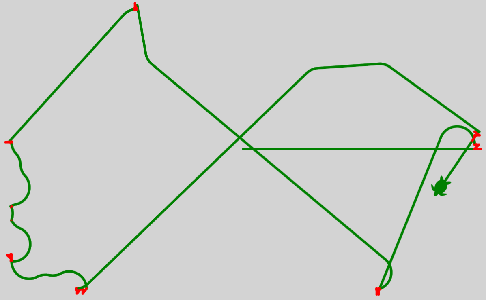
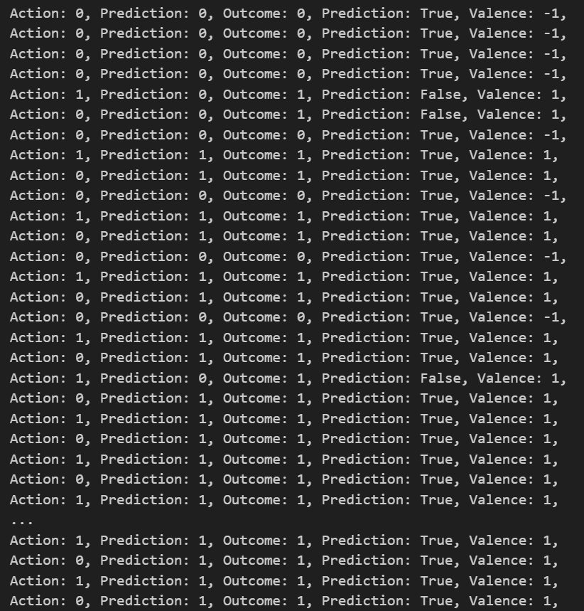

Abida Youssef (p2024398) Faure Alexandre (p2006157)

# Agent 1

Dans la classe `Agent1`, l'agent a une mémoire qui stocke les résultats (*outcome*) associés à chaque action (0 ou 1). Cette mémoire lui permet d'apprendre à prédire les outcomes futurs basés sur ses interactions précédentes.

- L'agent commence par choisir l'action 0 et anticipe un outcome par défaut de 0.

- Lorsqu'une action produit un outcome différent de ce qui était anticipé, l'agent met à jour sa mémoire pour associer cet outcome à l'action correcte et le compteur d'ennui se réinitialise.

- Pour simuler l'ennui, l'agent change d'action après 4 cycles de bonnes prédictions d'outcome.

```py
class Agent1(Agent):
    def __init__(self):
        super().__init__()
        self.memory = {0: None, 1: None}
        self._compteur = 0
        self._action = 0
        self._action = None
        self._predicted_outcome = None
        
    def action(self, _outcome):
        if self._action is not None:
            print(f"Action: {self._action}, Prediction: {self._predicted_outcome}, Outcome: {_outcome}, " 
                  f"Satisfaction: {self._predicted_outcome == _outcome}")
        else :
            self._action = 0
            self._predicted_outcome = 0
            self._compteur += 1
            return self._action

        if self._predicted_outcome == _outcome:
            self._compteur += 1
        else:
            self._compteur = 0
            
        if self._predicted_outcome != _outcome:
            self.memory[self._action] = _outcome
            self._predicted_outcome = _outcome

        if self._compteur == 4:
            if self._action == 0:
                self._compteur = 0
                self._action = 1
            else:
                self._compteur = 0
                self._action = 0

        """ Computing the next action to enact """
        if self.memory[self._action] is None:
            self._predicted_outcome = 0
        else:
            self._predicted_outcome = self.memory[self._action]
        
        return self._action
```

### Les anticipations suivantes sont basées sur la mémoire de l'agent.


Capture d'écran de l'exécution de l'agent 1 dans l'environnement 1. 

# Agent 2

Dans la classe `Agent2`, l'agent a une mémoire qui stocke les résultats (*outcome*) associés à chaque action (0 ou 1). Il dispose aussi d'un tableau de valences qui lui indique les préférences d'action à réaliser. Comme `l'Agent 1`, cette mémoire lui permet d'apprendre à prédire les outcomes futurs basés sur ses interactions précédentes.

- L'agent commence par choisir l'action 0 et anticipe un outcome par défaut de 0.

- Lorsqu'une action produit un outcome différent de ce qui était anticipé, l'agent met à jour sa mémoire pour associer cet outcome à l'action correcte. Il met à jour sa prédiction et le compteur d'ennui se réinitialise.

- Pour choisir la meilleur action, l'agent compare les valences de chaque action et choisit celle qui a la valence la plus élevée.

- Pour simuler l'ennui, l'agent change d'action après 4 cycles de bonnes prédictions d'outcome.

Les valences définies pour l'environnement 2 sont les suivantes :

|| outcome 0 | outcome 1 |
|---|---|---|
| action 0 | -1 | 1 |
| action 1 | 1 | -1 |

```py
class Agent2(Agent):
    def __init__(self, _valences):
        super().__init__(_valences)
        self.memory = dict()
        self._compteur = 0
        self._best_action = None
        
    
    def action(self, _outcome):
        """ tracing the previous cycle """
        if self._action is not None:
            print(f"Action: {self._action}, Prediction: {self._predicted_outcome}, Outcome: {_outcome}, "
                  f"Prediction: {self._predicted_outcome == _outcome}, Valence: {self._valences[self._action][_outcome]}")
        else :
            self._action = 0
            self._predicted_outcome = 0
            self._compteur += 0
            self._best_action = 0
            self._best_outcome = _outcome
            return self._action
        
        if self._predicted_outcome == outcome:
            self._compteur += 1
        else:
            self._compteur = 0
            
        if self._predicted_outcome != _outcome or self.action not in self.memory:
            self.memory[self._action] = _outcome
            self._predicted_outcome = _outcome
            
        if self._best_action is None:
            self._best_action = self._action
        else :
            for i in self.memory:
                if self._valences[self._best_action][self.memory[self._best_action]] < self._valences[i][self.memory[i]]:
                    self._best_action = i
            
        if self._action != self._best_action:
            self._action = self._best_action
        
        if self._compteur == 4:
            if self._action == 0:
                self._action = 1
                self._compteur = 0
            else:
                self._action = 0
                self._compteur = 0
        
        """ Computing the next action to enact """
        if self._action not in self.memory:
            self._predicted_outcome = 0
        else:
            self._predicted_outcome = self.memory[self._action]
            
        return self._action
```

### Les anticipations suivantes sont basées sur la mémoire de l'agent.


Capture d'écran de l'exécution de l'agent 2 dans l'environnement 2. 

# Agent 3

Dans la classe `Agent3`, on reprend les mêmes principes que pour `l'Agent 2`. De plus, l'agent a un tableau de booléens qui lui permet de savoir si une action a déjà été testée ou non. Ce tableau est utilisé pour choisir une action non testée lorsqu'il est ennuyé.

L'agent 3 sert à apprendre à naviguer notre tortue (*l'agent*) dans un `ColabTurtleEnvironment`. Dans cette environnement, possède 3 actions possibles : avancer, tourner à gauche et tourner à droite. L'agent doit apprendre à naviguer dans l'environnement en evitant les murs.

- L'agent commence par choisir l'action 0 et anticipe un outcome par défaut de 0.

- Lorsqu'une action produit un outcome différent de ce qui était anticipé, l'agent met à jour sa mémoire pour associer cet outcome à l'action correcte. Il met à jour sa prédiction et le compteur d'ennui se réinitialise.

- Pour choisir la meilleur action, l'agent compare les valences de chaque action et choisit celle qui a la valence la plus élevée. Si plusieurs actions ont la même valence, l'agent choisit aléatoirement parmi ces actions.

- Pour simuler l'ennui, l'agent change d'action après 4 cycles de bonnes prédictions d'outcome. Lorsqu'il est ennuyé, l'agent choisit une action non testée.

Les valences définies pour l'environnement 3 sont les suivantes :

|| 0 Not bump | 1 Bump|
|---|---|---|
| 0 Forward| 1 | -1 |
| 1 Left | -1 | -1 |
| 2 Right| -1 | -1 |

```py
import random

class Agent3(Agent):
    def __init__(self, _valences):
        super().__init__(_valences)
        self.memory = dict()
        self._compteur = 0
        self._best_action = None
        self._tab_best_action = list()
        self._test_action =list()
        for i in range(len(_valences)):
            self._test_action.append(False)
        
    def action(self, _outcome):
        """ tracing the previous cycle """
        if self._action is not None:
            print(f"Action: {self._action}, Prediction: {self._predicted_outcome}, Outcome: {_outcome}, "
                  f"Prediction: {self._predicted_outcome == _outcome}, Valence: {self._valences[self._action][_outcome]}")
        else :
            self._action = 0
            self._test_action[self._action] = True
            self._predicted_outcome = 0
            self._compteur += 0
            self._best_action = 0
            self._best_outcome = _outcome
            return self._action
        self._tab_best_action = list()
        if self._predicted_outcome == outcome:
            self._compteur += 1
        else:
            self._compteur = 0
        if self._predicted_outcome != _outcome or self.action not in self.memory:
            self.memory[self._action] = _outcome
            self._predicted_outcome = _outcome
            
        if self._best_action is None:
            self._best_action = self._action
        else :
            for i in self.memory:
                if self._valences[self._best_action][self.memory[self._best_action]] < self._valences[i][self.memory[i]]:
                    self._best_action = i
                elif self._valences[self._best_action][self.memory[self._best_action]] == self._valences[i][self.memory[i]]:
                    self._tab_best_action.append(i)
            
        if len(self._tab_best_action) > 0:
            self._action = self._tab_best_action[random.randint(0,len(self._tab_best_action)-1)]
        
        if self._compteur == 4:
            for i in range(len(self._test_action)):
                find = False
                if self._test_action[i] == False:
                    self._action = i
                    self._test_action[i] = True
                    self._compteur = 0
                    find = True
                    break
            if find == False:
                self._action = random.randint(0,len(self._valences)-1)
                self._compteur = 0
        
        """ Computing the next action to enact """
        if self._action not in self.memory:
            self._predicted_outcome = 0
        else:
            self._predicted_outcome = self.memory[self._action]
            
        return self._action
```

### Résultats de 100 actions de l'agent 3 dans un ColabTurtleEnvironment




# Agent 4

Dans la classe `Agent4`, l'agent a une mémoire qui lui permet de stocker le couple d'intéractions précédentes et les interactions tentées. L'agent apprend à prédire les outcomes futurs basés sur ses interactions précédentes. 

- Si le couple clé (*t-1, t*) n'est pas dans la mémoire, alors on lui assigne une valeur à `None` et lors du prochain calcule de l'action, on lui assigne la valeur de l'outcome. 

- Si le compteur est inférieur ou égal à 3, alors on regarde dans la mémoire si on a une interaction qui correspond à la clé (*t-1, t*) et si l'outcome est supérieur à 0, alors on choisit cette interaction.

- Si le compteur est supérieur à 3, alors on simule l'ennui. On choisit une action aléatoire parmi les actions possibles.

- Pour choisir la meilleur action, l'agent compare les valences de chaque action et choisit celle qui a la valence la plus élevée.


Les valences définies pour l'environnement 3 sont les suivantes :

|| outcome 0 | outcome 1|
|---|---|---|
| action 0| -1 | 1 |
| action 1 | -1 | 1 |
| action 2 | -1 | 1 |

```py
import random

class Agent4(Agent):
    """Creating our agent"""
    def __init__(self, _interactions):
        """ Initialize the dictionary of interactions"""
        self._interactions = {interaction.key(): interaction for interaction in _interactions}
        self._intended_interaction = self._interactions["00"]
        self._memory = {}
        self._action_possible = [0, 1, 2]
        self.compteur = 0
        
    def action(self, _outcome):
        """ Tracing the previous cycle """
        previous_interaction = self._interactions[f"{self._intended_interaction.action}{_outcome}"]
        print(f"Action: {self._intended_interaction.action}, Prediction: {self._intended_interaction.outcome}, Outcome: {_outcome}, "
              f"Prediction: {self._intended_interaction.outcome == _outcome}, Valence: {previous_interaction.valence},")        
        temp = self._memory.copy()
        for key in temp:
            if self._memory[key] == None:
                self._memory[(key[0],key[1][0] + str(_outcome))] = _outcome
                if self._memory[key] == None:
                    self._memory.pop(key)
        
        if self._intended_interaction.outcome == _outcome:
            self.compteur += 1
        else:
            self.compteur = 0
        
        if self.compteur <= 3:
            for key in self._memory:
                if key[0] == previous_interaction.key():
                    if self._memory[key] != None and self._memory[key] > 0:
                        self._intended_interaction = self._interactions[key[1]]
                        self._intended_interaction.outcome = self._memory[key]
                        return self._intended_interaction.action
        
        intended_action = 0
        best_valence = float('-inf')
        for action in self._action_possible:
            interaction_key = f"{action}{_outcome}"
            interaction = self._interactions[interaction_key]
            if interaction.valence > best_valence:
                best_valence = interaction.valence
                intended_action = action
        
        if self.compteur > 3:
            while intended_action == self._intended_interaction.action:
                intended_action = random.choice(self._action_possible)
            self.compteur = 0
            # print("changement d'action")
        """ Computing the next interaction to try to enact """
        intended_outcome = None
        for key in self._memory:
            if key[0] == previous_interaction.key() and key[1][0] == str(intended_action):
                if self._memory[key] != None:
                    intended_outcome = key[1][1]
        if intended_outcome == None:
            intended_outcome = 0
        
        # Memorize the intended interaction
        self._intended_interaction = self._interactions[f"{intended_action}{intended_outcome}"]
        if (previous_interaction.key(),self._intended_interaction.key()) not in self._memory:
            self._memory[(previous_interaction.key(),self._intended_interaction.key())] = None
        return intended_action
```

### Les anticipations suivantes sont basées sur la mémoire de l'agent.



Capture d'écran de l'exécution de l'agent 4 dans l'environnement 3 pour 50 actions. 

### Résultats de 50 actions de l'agent 4 dans un ColabTurtleEnvironment


